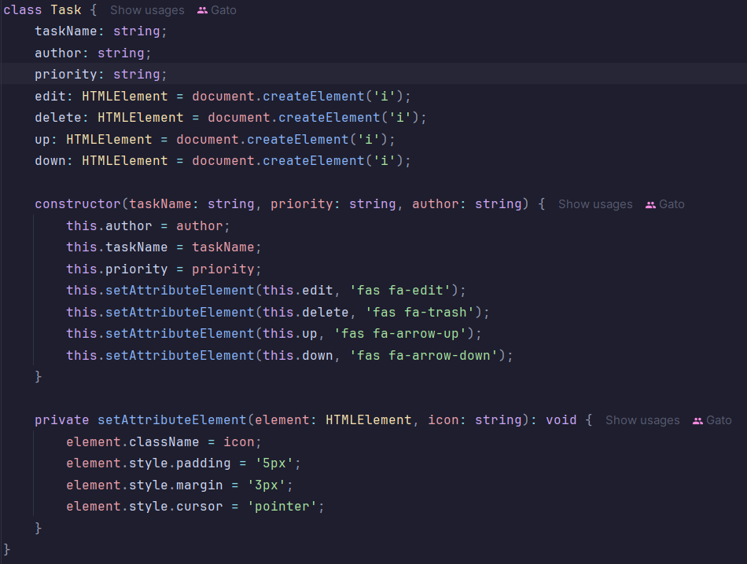
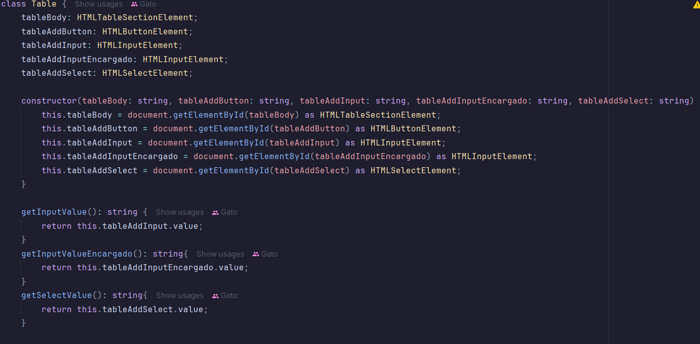
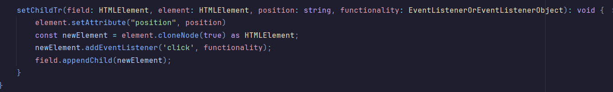
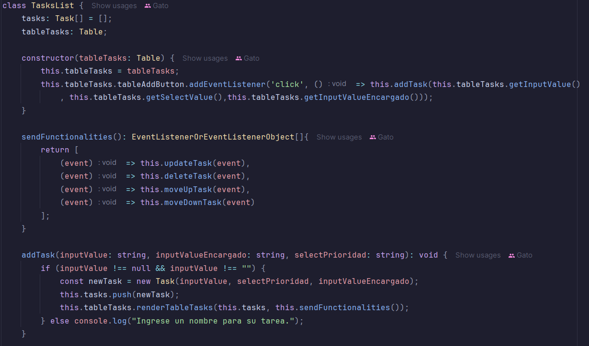
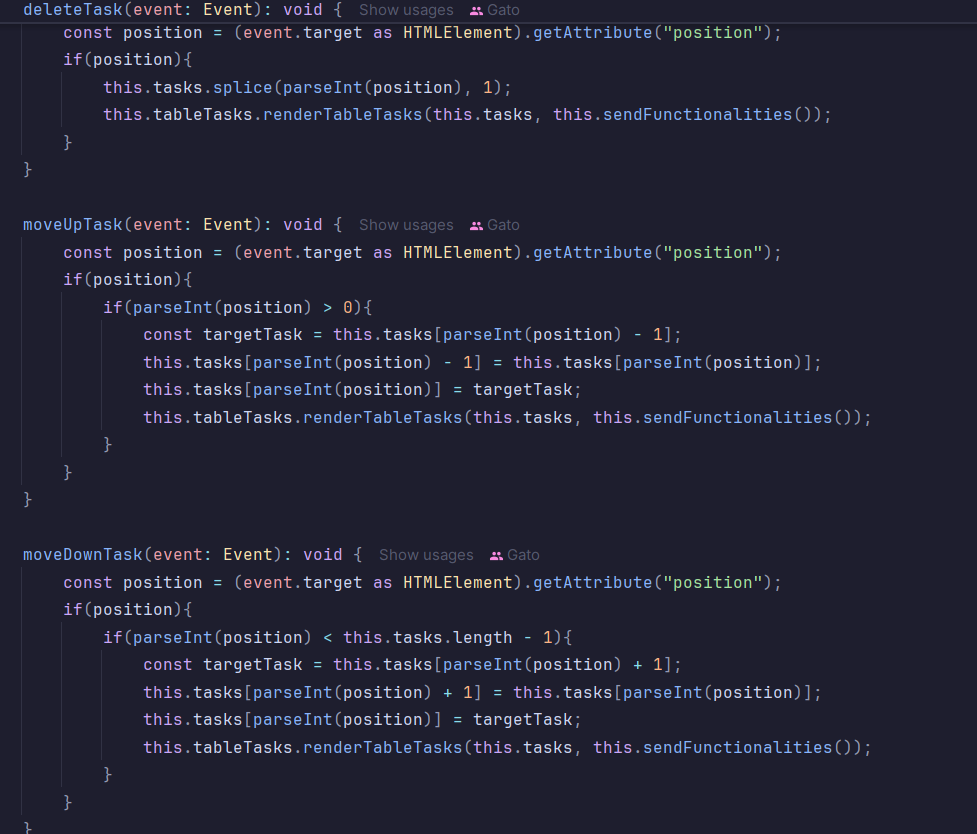
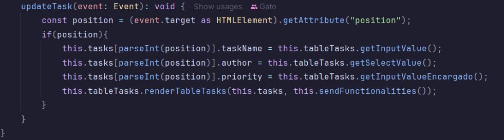

Se modifico y optimizo la clase Task agregando los campo author y priority.
Ahora cada objeto task crea independientemente sus iconos.

La clase Table utiliza los elementos html necesarios para el funcionamiento del programa,
 su metodo mas importante es el de renderizar la tabla, setea las funciones importantes
a cada boton de las task con su posicion actual.

Se creo la clase TasksList que utiliza las 2 clases anteriores maneja las 4 funciones pedidas
y las manda a la tabla para su seteo a cada boton, asi reutilizando codigo y abierto a nuevas
implementaciones.

