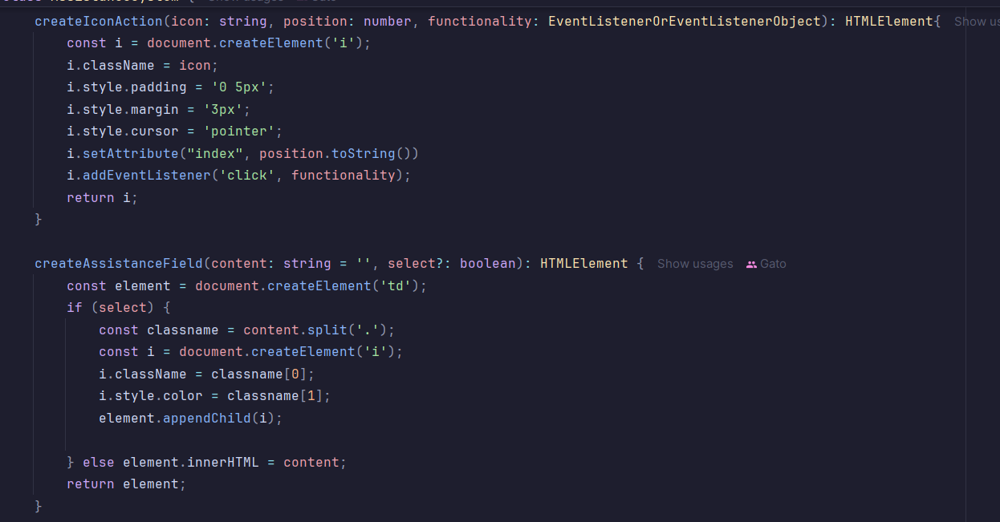

Clase Assistance y su almacenamiento en memoria local del navegador

La clase AssistanceElements crea dinámicamente los elementos HTML para
su posterior uso asi dividiendo las tareas de cada clase. También implementa
la logica para imprimir iconos.

La clase AssistanceSystem usa las 2 clases anteriores y usa sus metodos y
atributos en su función principal RenderAssistsSystem. La funcion maneja
el atributo date dependiendo si el usuario llena o no el campo fecha.

Desarrollador: Oswaldo Maguiño Soto